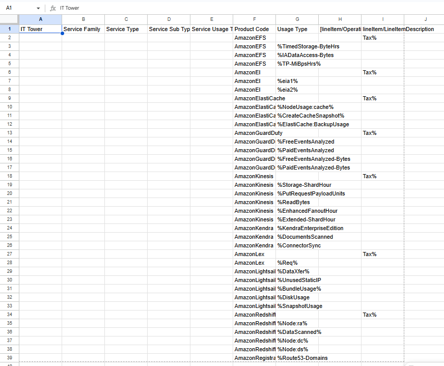
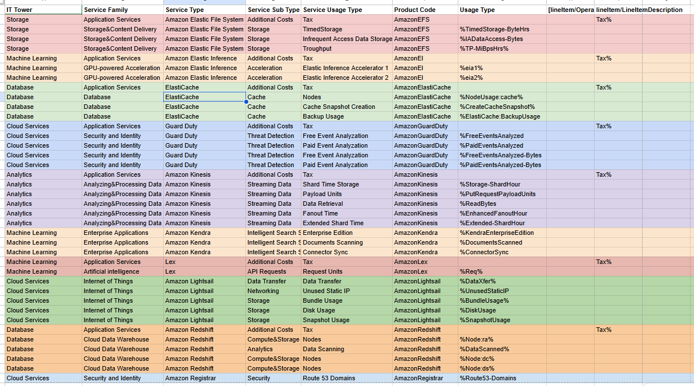

# **Отчёт по лабораторной работе 1. Знакомство с IaaS, PaaS, SaaS сервисами в облаке на примере Amazon Web Services (AWS). Создание сервисной модели. Вариант 6**
## **Цель работы**
Знакомство с облачными сервисами. Понимание уровней абстракции над инфраструктурой в облаке. Формирование понимания типов потребления сервисов в сервисной-модели. 

## **Дано:**
1. Слепок данных биллинга от провайдера после небольшой обработки в виде SQL-параметров. Символ % в начале/конце означает, что перед/после него может стоять любой набор символов.
2. Образец итогового соответствия, что желательно получить в конце. В этом же документе  

## **Необходимо:**
1. Импортировать файл .csv в Excel или любую другую программу работы с таблицами. Для Excel делается на вкладке Данные – Из текстового / csv файла – выбрать файл, разделитель – точка с запятой.
2. Распределить потребление сервисов по иерархии, чтобы можно было провести анализ от большего к меньшему (напр. От всех вычислительных ресурсов Compute дойти до конкретного типа использования - Выделенной стойка в датацентре Dedicated host usage).
3. Сохранить файл и залить в соответствующую папку на Google Drive.

## **Алгоритм работы:**
 Сопоставить входящие данные от провайдера с его же документацией. Написать в соответствие колонкам справа значения 5 колонок слева, которые бы однозначно классифицировали тип сервиса. Для столбцов IT Tower и Service Family значения можно выбрать из образца.

## **Ход работы:**
1. Вариант был выбран изходя из формулы:(номер моей строки в таблице) mod (кол-во вариантов)

2. Данный слепок биллинга от провайдера, представленный в таблице с расширением .csv был импортирован в Google Sheets. Изначальные данные имели следующий вид:

3. Воспользовавшись оффициальной документацией AWS, я описала все сервисы, которые находятся в таблице, а именно:

1) Amazon Elastic File System -- это полностью управляемый, эластичный сервис файлового хранилища. Он предназначен для создания общего файлового хранилища, к которому могут одновременно обращаться множество вычислительных ресурсов AWS и локальных серверов, избавляя пользователя от необходимости управления инфраструктурой.

2) Amazon Elastic Inference -- сервис, который предоставляет возможность подключать GPU-ускорение для задач глубокого обучения к Amazon EC2, SageMaker AI и Amazon ECS.

3) Amazon ElastiCache — это полностью управляемый сервис кэширования в оперативной памяти, поддерживающий Redis, Valkey и Memcached. Он повышает производительность приложений, обеспечивая доступ к данным с задержкой в микросекунды. Сервис снижает нагрузку на внутренние базы данных в высоконагруженных приложениях реального времени, таких как игры, электронная коммерция и проекты в сфере ИИ. ElastiCache предлагает как бессерверные, так и серверные варианты развертывания, обеспечивая автоматическое масштабирование, высокую доступность и надежную безопасность.

4) Amazon GuardDuty — это сервис непрерывного интеллектуального мониторинга безопасности, который защищает аккаунты AWS, рабочие нагрузки и данные. Он анализирует потоки VPC Flow Logs, журналы CloudTrail и DNS-логи на предмет подозрительной активности.

5) Amazon Kinesis — это полностью управляемая платформа на AWS, предназначенная для сбора, обработки и анализа потоковых данных в реальном времени.

6) Amazon Kendra — это высокоточный интеллектуальный поисковый сервис на базе машинного обучения. Он позволяет предприятиям искать информацию в различных хранилищах контента (например, SharePoint, Amazon S3 или базах данных), используя естественный язык. Благодаря пониманию контекста, Kendra выдает прямые ответы, релевантные фрагменты документов или часто задаваемые вопросы (FAQ), а не просто ссылки на страницы.

7) Amazon Lex — это полностью управляемый сервис AWS для создания голосовых и текстовых интерфейсов на базе искусственного интеллекта в приложениях, использующий ту же технологию, что и Alexa. Сервис позволяет разработчикам создавать, тестировать и развертывать чат-ботов.

8) Amazon Lightsail — это облачная платформа и сервис виртуальных выделенных серверов (VPS), которые подходят для недорогих проектов с низкой сложностью, например, для создания веб-сайтов или веб-приложений.

9) Amazon Redshift — это быстрый, полностью управляемый облачный сервис для хранения данных петабайтного масштаба. Он позволяет компаниям выполнять сложные аналитические запросы на больших объемах данных, используя стандартный SQL.

10) Amazon Registrar — это регистратор доменных имен, который используется для управления доменами через сервис Amazon Route 53. Он позволяет клиентам регистрировать, передавать и продлевать доменные имена непосредственно в экосистеме AWS, предлагая встроенную защиту конфиденциальности и интеграцию с DNS-сервисами AWS.

В ходе выполнения работы я сапоставляла имеющуюся иформацию с документацие AWS, а также делала дополнительные умозаключения и получила следующую таблицу с размеченными данными о сервисах:

## **Вывод**
В ходе лабораторной работы я познакомилась с 10 видами сервисов и нашла их типы, расположенные по иерархии над ними. Также данная работа дала мне структурное понимание с раюотой AWS и в дальнейшем я бы хотела применять эти знания в работе. Таким образом, цель данной работы была достигнута.