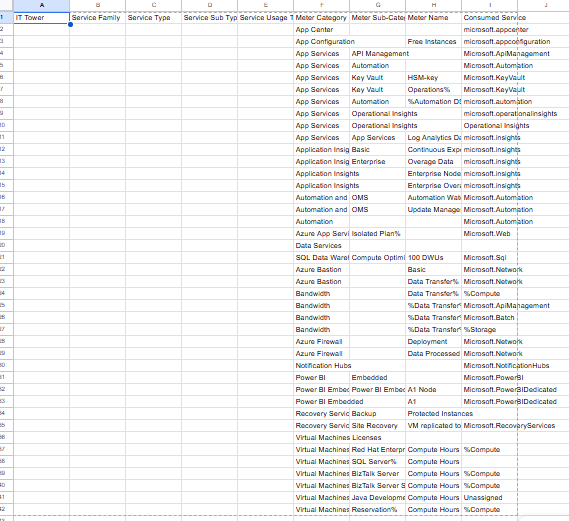
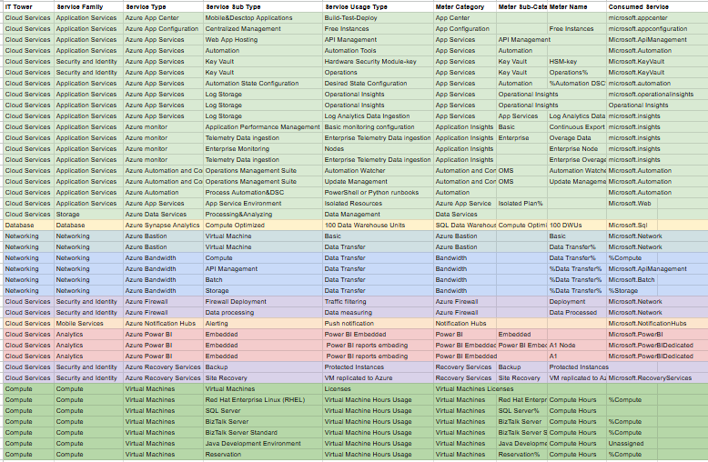

# **Отчёт по лабораторной работе 2.  Сравнение сервисов Amazon Web Services и Microsoft Azure. Создание единой кросс-провайдерной сервисной модели. Вариант 6**
## **Цель работы**
Получение навыков аналитики и понимания спектра публичных облачных сервисов без привязки к вендору. Формирование у студентов комплексного видения Облака. 

## **Дано:**
1. Данные лабораторной работы 1.
2. Слепок данных биллинга от провайдера после небольшой обработки в виде SQL-параметров. Символ % в начале/конце означает, что перед/после него может стоять любой набор символов.
3. Образец итогового соответствия, что желательно получить в конце. В этом же документе  
 

## **Необходимо:**
1. Импортировать файл .csv в Excel или любую другую программу работы с таблицами. Для Excel делается на вкладке Данные – Из текстового / csv файла – выбрать файл, разделитель – точка с запятой.
2. Распределить потребление сервисов по иерархии, чтобы можно было провести анализ от большего к меньшему (напр. От всех вычислительных ресурсов Compute дойти до конкретного типа использования - Выделенной стойка в датацентре Dedicated host usage). При этом сохранять логическую концепцию, выработанную в Лабораторной работе 1.
3. Сохранить файл и залить в соответствующую папку на Google Drive.

## **Алгоритм работы:**
Сопоставить входящие данные от провайдера с его же документацией. Написать в соответствие колонкам справа значения 5 колонок слева, которые бы однозначно классифицировали тип сервиса. Для столбцов IT Tower и Service Family значения можно выбрать из образца. В ходе выполнения работы не отходить от принципов классификации, выбранных в Лабораторной работе 1. Например, если сервис Машинного обучения был разбит на Вычислительные мощности и Облачные сервисы, то продолжать его разбивать и в новых данных.

## **Ход работы:**
1. Вариант был выбран изходя из формулы:(номер моей строки в таблице) mod (кол-во вариантов)

2. Данный слепок биллинга от провайдера, представленный в таблице с расширением .csv был импортирован в Google Sheets. Изначальные данные имели следующий вид:

3. Воспользовавшись оффициальной документацией Azure, а также сервисом Microsoft Learn я описала все сервисы, которые находятся в таблице, а именно:

1) Azure App Center -- это сервис для мобильных и десктопных приложений (iOS, Android, Windows, macOS), который позволяет разработчикам автоматизировать процессы сборки, тестирования и распространения приложений, а также предоставляет аналитику и диагностику для мониторинга производительности.

2) Azure App Configuration -- это сервис для управлять конфигурациями и хранение их в распределенных средах.

3) Azure App Service -- это сервис для  создания, развертывания и масштабирования веб-приложений, API и мобильных серверных частей.

4) Azure Application Insights -- это сервис  мониторинга производительности приложений, который помогает разработчикам отслеживать работающие приложения, обнаруживать и диагностировать проблемы, а также понимать поведение пользователей.

5) Azure Automation -- это сервис, который упрощает управление ИТ-инфраструктурой за счет автоматизации частых и трудоемких задач в средах Azure и гибридных средах.

6) Azure SQL Data Warehouse -- это сервис для хранения и аналитики больших данных

7) Azure Bastion -- это сервис для доступа к виртуальным машинам Azure напрямую через портал Azure с использованием TLS (Transport Layer Security)

8) Azure Firewall -- это сервис сетевой безопасности, предназначенный для защиты ресурсов виртуальной сети Azure.

9) Azure Notification Hubs -- это сервис для отправки push-уведомлений на устройства iOS, Android, Windows и Kindle.

10) Azure Power BI -- это сервис, который позволяет подключаться к огромным наборам данных из различных источников, визуализировать и анализировать их, обеспечивая интерактивную отчетность в реальном времени, встроенную аналитику в приложениях и аналитические выводы на базе искусственного интеллекта.

11) Azure Recovery Services -- это сервис для защиты и восстановления данных.

12) Azure Virtual Machines -- сервис для работы с виртуальными машинами. Пользователи получают полный контроль над операционной системой и конфигурацией, а также доступ к таким функциям, как автоматическое масштабирование, интеграция с хранилищами и средства безопасности.

В ходе выполнения работы я получила следующую [таблицу](https://docs.google.com/spreadsheets/d/1acSiSihSGw8lI_g5sBctDGIQXfPDJ3y2K5JkLFhRCQI/edit?usp=sharing) с размеченными данными о сервисах:

## **Вывод**
В ходе лабораторной работы я познакомилась с еще 12 видами сервисов. Хотела бы обратить внимание на понятность и удобность документации Azure и попросить AWS взять с нее пример. Сервисы Azure и AWS предоставляют похожие облачные услуги: хранилища, защита, анализ данных, виртуальные машины, передача данных. 
Также данная работа дала мне структурное понимание работы Azure и в дальнейшем я бы хотела применять эти знания в работе. Таким образом, цель данной работы была достигнута.

