# **Отчёт по лабораторной работе 1 DevOps**
## **Цель:**
Настроить nginx по заданному тз:
1) Должен работать по https c сертификатом
2) Настроить принудительное перенаправление HTTP-запросов (порт 80) на HTTPS (порт 443) для обеспечения безопасного соединения.
3) Использовать alias для создания псевдонимов путей к файлам или каталогам на сервере.
4) Настроить виртуальные хосты для обслуживания нескольких доменных имен на одном сервере.
5) Что угодно еще под требования проекта

## **Ход работы:**
1) Сначала установим.
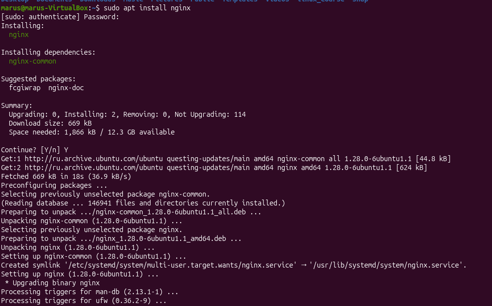

2) Проверим, открывается ли мой пока пустой веб-сервер. 
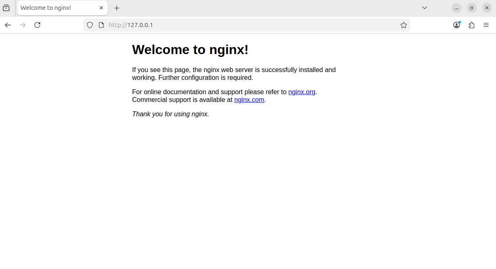

Все хорошо.

3) Теперь надо создать два локальных сайта (project1, project2), а также добавить директории для их хранения и файлы index.html внутри.

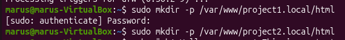
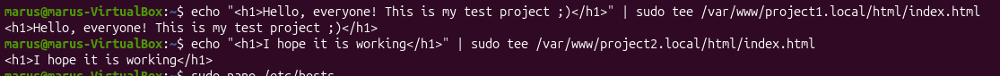

4) Теперь пропишем домены project1.local и project2.local в файле /etc/hosts. Это нужно для того, чтобы их можно было тестировать локально. Т.к. по заданию доменные имена должны обслуживаться на одном сервере nginx, то надо присвоить им один адрес.

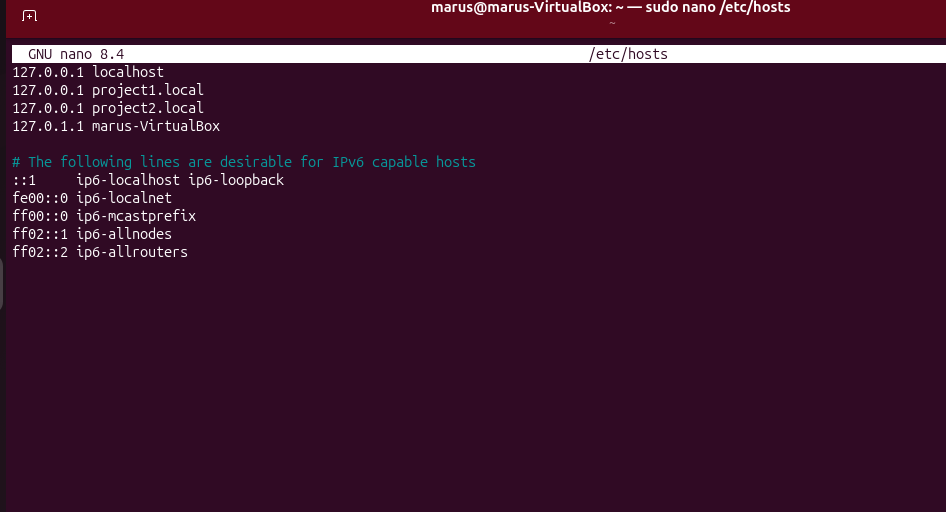

5) Далее нужно сделать конфигурацию веб-сервера nginx, которая автоматически перенаправляет посетителей с незащищенного протокола http на защищённый протокол https. В конфигурационном файле указываем, что сервер будет слушать входящие запросы на 80 порту, указываем имя server_name, тем самым это правило будет работать только для домена project1.local (и project2.local, но для него пропишем в его собственном конфиге), а также указываем, что сервер будет перенапрявлять запросы на https.

6) Теперь пропишем еще один блок, который будет работать с https. По заданию нужно настроить работу по https с сертификатом. Сертификат можно сгенерировать позже, поэтому здесь пока пропишем пути к файлу SSL-сертификата и приватного ключа. Далее определяем корневую директорию, где хранятся файлы сайта и задаем файл (index.html), который будет отдаваться по умолчанию при обращении к корню сайта.

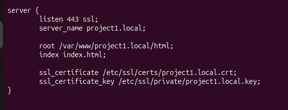

Для второго сайта я проделала такую же работу.

7) Далее активируем конфигурации и создаем самоподписанные сертификаты.

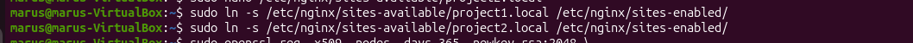

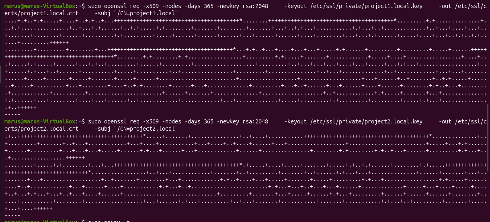

8) После перезапуска проверям правильность работы.

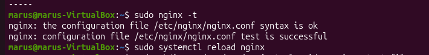

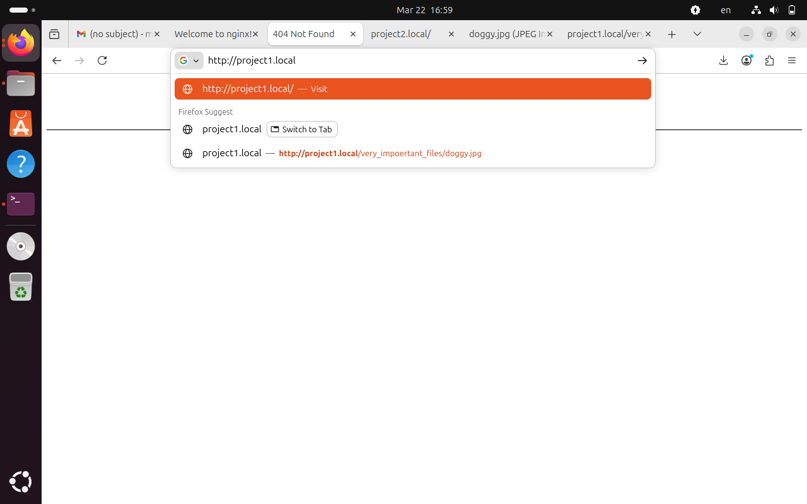

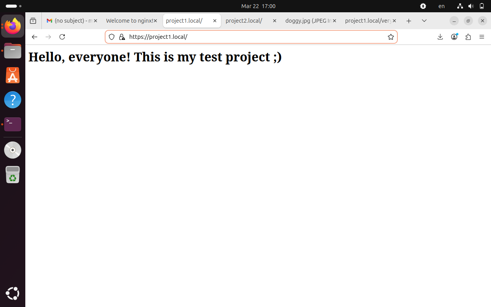

Как мы видим при запросы к странице по http сервер перенапраляет нас на https.

То же самое работает и для второго сайта.

.png>)

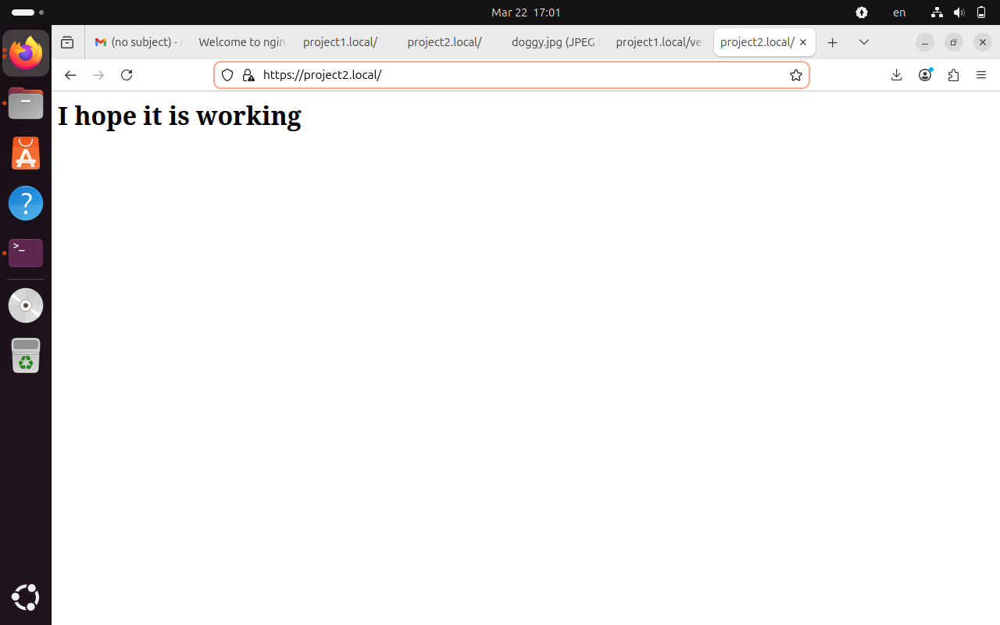

9) Далее для демонстрации работы alias создадим папку very_important_files и положим туда текстовый файл с перечислением песен альбома Artpop Леди Гаги, а также файл с картинкой собачки с букетиком. Данную папку добавим на сайт project1.

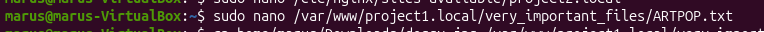

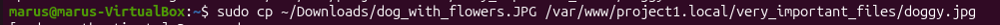

В конфигурационном файле при помощи alias создаем псевдоним к папке very_important_files.

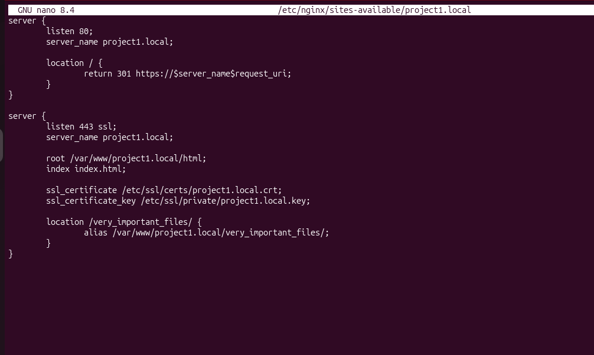

10) Теперь затестим то, что у нас получилось.

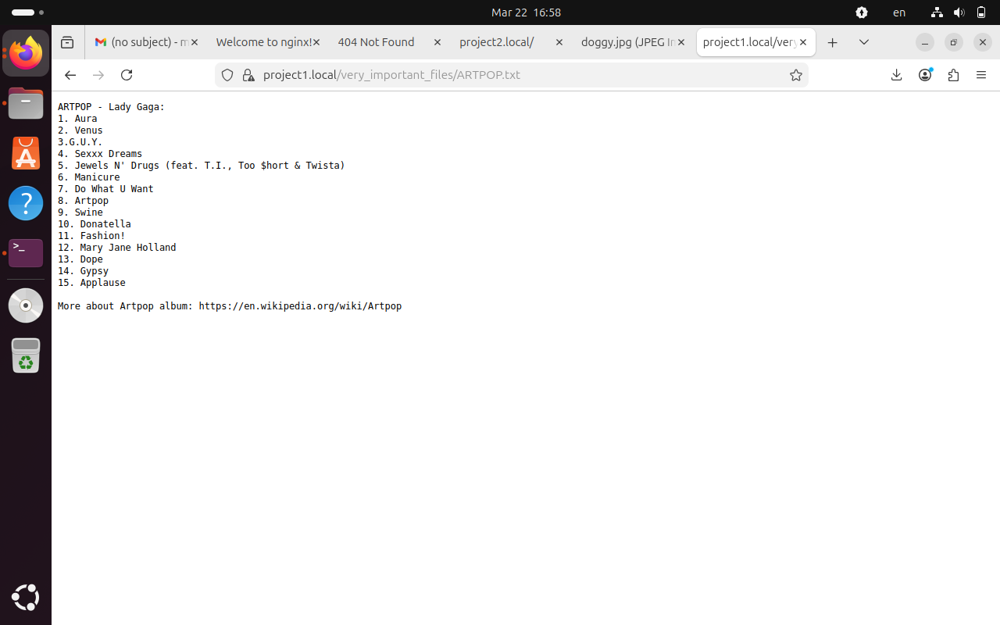

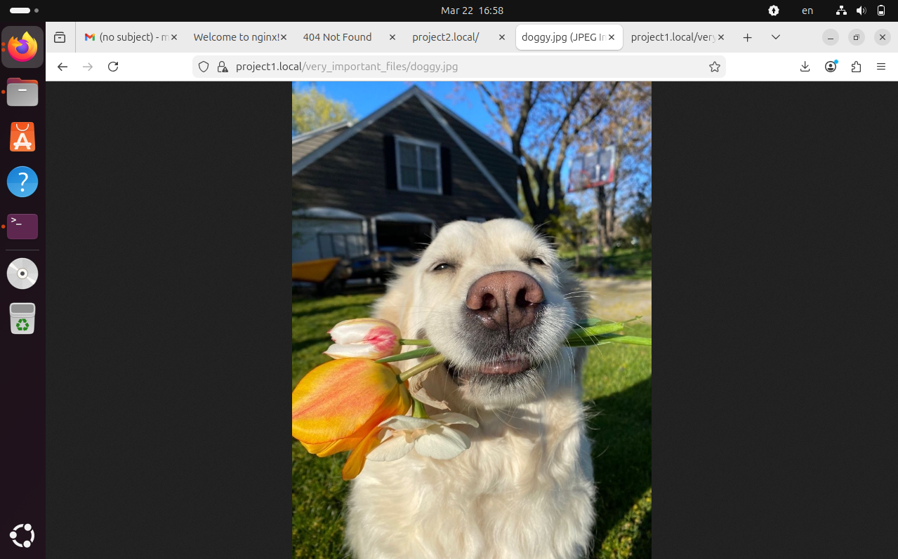

Как видно мы можем в браузере обратиться и к тесктовому файлу и к собакену.

Таким образом, все получилось и все работает!)

