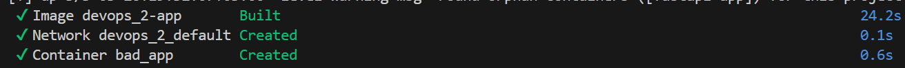
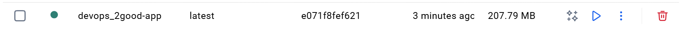
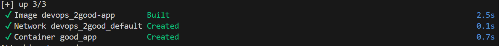

# **Отчёт по лабораторной работе 2 DevOps**
## **Цель:**
1. Написать “плохой” Dockerfile, в котором есть не менее трех “bad practices” по написанию докерфайлов
2. Написать “хороший” Dockerfile, в котором эти плохие практики исправлены
3. В Readme описать каждую из плохих практик в плохом докерфайле, почему она плохая и как в хорошем она была исправлена, как исправление повлияло на результат
4. В Readme описать 2 плохих практики по работе с контейнерами. ! Не по написанию докерфайлов, а о том, как даже используя хороший докерфайл можно накосячить именно в работе с контейнерами.

## **Ход работы:**
1. Сначала напишем простое приложение, используя Fastapi, которое будет выдавать фразу "Hello World" на основной странице и статус "здоровья" приложения на странице с /health.

```
from fastapi import FastAPI
import uvicorn

app = FastAPI()


@app.get("/")
async def root():
    return {"message": "Hello World"}


@app.get("/health")
async def health():
    return {"status": "ok"}

if __name__ == '__main__':
    uvicorn.run(app, host='0.0.0.0', port=8000)
```

2. Теперь напишем плохой Dockerfile c "bad practices"

```
FROM python:latest

USER root

WORKDIR /app

COPY . .

RUN pip install --no-cache-dir -r requirements.txt

CMD ["python", "app.py"]
```
3. Создадим образ на основе этого Dockerfile

`docker-compose up --build`




4. Теперь напишем хороший Dockerfile с исправленными плохими практиками и создадим образ на его основе

```
FROM python:3.11-slim

RUN useradd -ms /bin/bash maya_user

USER maya_user

WORKDIR /app

COPY requirements.txt .

RUN pip install --no-cache-dir -r requirements.txt

COPY app.py .

CMD ["python", "app.py"]
```





Как мы видим правильный Dockerfile и собирается быстрее и весит намного меньше, чем неправильно написанный Dockerfile.

## **Bad practices в Dockerfile**:
1. Использование тега latest или отсутствие версии образа `FROM python:latest`
Данная практика является плохой, т.к. мы не контролируем обновление нашей системы.
Если сегодня собрать образ с latest, а завтра — снова, но разработчик базового образа выпустит обновление, то получатся два разных образа. Приложение может перестать работать из-за несовместимости библиотек.

2. Запуск контейнера от root (по умолчанию) `USER root`
Данная практика опасна, т.к. при взломе приложения злоумышленник получает права суперпользователя внутри контейнера. Это облегчает побег из контейнера (container escape) и получение контроля над всей хост-машиной. 

3. Установливание зависимости после копирования файлов
Данная практика является плохой, т.к. это сбрасывает кэш сборки Docker. При любом изменении в коде (даже одной строке), Docker будет заново скачивать и устанавливать все библиотеки, что значительно замедляет сборку образа.

4. Копирование всех файлов `COPY . .`
Данная практика является плохой, т.к. это увеличивает размер образа, замедляет сборку из-за кэширования лишних данных и создает риски безопасности, включая в контейнер секреты или чувствительные файлы.

## **Good practices в Dockerfile**:
1. Указание версии образа `FROM python:3.11-slim`
Использование конкретного тега версии позволяет всегда работать с одной и той же версией. Мы контролируем обновление нашей системы.

2. Создание пользователя, чтобы запускать контейнер от его имени, а не от root.

```
RUN useradd -ms /bin/bash maya_user

USER maya_user
```
Теперь контейнер работает с минимальными правами, что обеспечивает безопасность

3. Копирование файлов после установления зависимости.
Это позволяет Docker использовать закэшированный слой с установленными библиотеками, если файлы исходного кода меняются, а список зависимостей — нет, что значительно ускоряет сборку. 

4. Копирование только нужных файлов `COPY requirements.txt .` `COPY app.py .`.
Мы добавляем в контейнер только нужные файлы, уменьшаем его размер, тем самым он собирается намного быстрее. 

## **Плохие практики работы с Docker**
1. Смешивать и путать образы, используемые для разработки, с образами для развертывания.
Образы, которые разворачиваются на продакшен серверах (код приложения в упакованном или скомпилированном виде + runtime) должны быть минималистичными, безопасными и проверенными. Образы развертывания (для СI/CD систем) могут не отвечать таким строгим требованиям. 

2. Предоставление докеру неограниченного доступа к ресурсам (CPU/RAM).
Контейнер может употребить все ресурсы памяти, что может приводить к сбоям, а в худшем случае к полному отказу системы.


